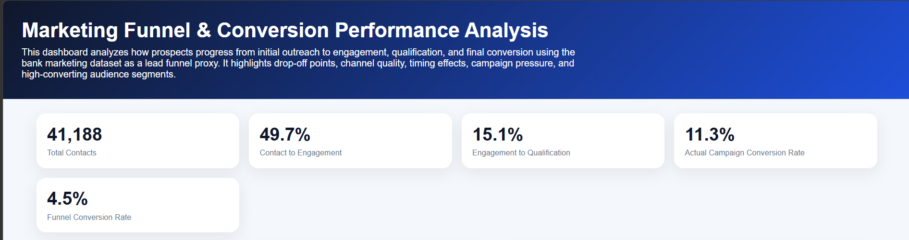
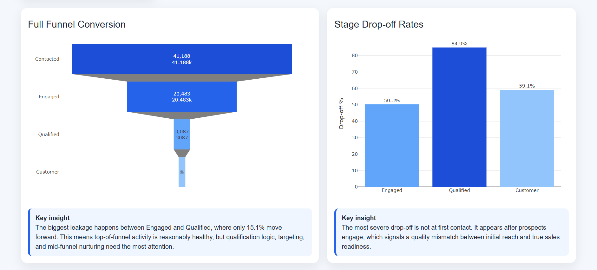
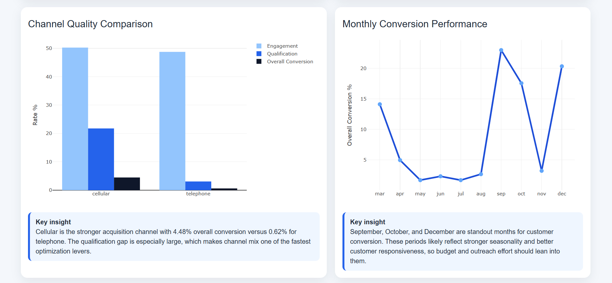
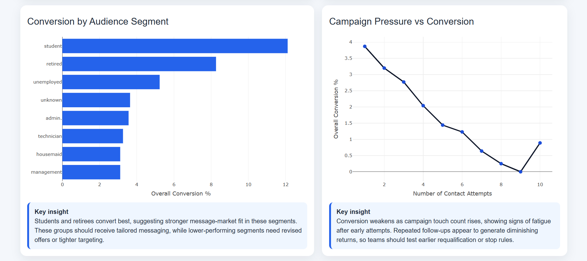
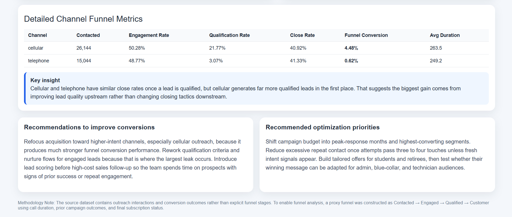

# Marketing Funnel & Conversion Performance Analysis

## Project Overview

This project performs a comprehensive marketing funnel and conversion analysis using the Bank Marketing Campaign dataset. The objective is to understand how prospects move through the marketing funnel, identify conversion bottlenecks, evaluate channel effectiveness, and uncover customer segments with the highest likelihood of conversion.

Since the source dataset does not contain explicit funnel stages, a proxy funnel was constructed using campaign interaction data and customer response behavior. The analysis helps identify opportunities to improve lead qualification, campaign targeting, and overall marketing performance.

---

## Dashboard Preview











---

## Objectives

- Data Cleaning & Preparation: Prepare campaign data for analysis
- Funnel Analysis: Model prospect progression through the marketing funnel
- Conversion Analysis: Measure customer conversion performance
- Channel Performance Analysis: Compare outreach channels
- Audience Segmentation: Identify high-converting customer groups
- Campaign Effectiveness Analysis: Evaluate impact of contact frequency
- Seasonal Trend Analysis: Identify high-performing campaign periods
- Visualization: Build an interactive dashboard for business insights

---

## Dataset Description

The project uses the Bank Marketing Campaign dataset containing customer outreach and campaign interaction records.

Key attributes include:

- age: Customer age
- job: Occupation category
- marital: Marital status
- education: Education level
- default: Credit default status
- housing: Housing loan status
- loan: Personal loan status
- contact: Contact communication type
- month: Last contact month
- day_of_week: Last contact weekday
- duration: Call duration in seconds
- campaign: Number of campaign contacts
- pdays: Days since previous contact
- previous: Number of previous contacts
- poutcome: Outcome of previous campaign
- y: Final campaign outcome (conversion)

---

## Funnel Methodology

The original dataset contains outreach interactions and conversion outcomes rather than explicit funnel stages.

To enable funnel analysis, a proxy marketing funnel was constructed:

- Contacted → Total outreach records
- Engaged → Contacts with above-median call duration
- Qualified → Engaged contacts with positive prior interaction indicators
- Customer → Successful campaign conversion (`y = yes`)

This approach allows meaningful funnel analysis despite the absence of native CRM or website funnel stages.

---

## Project Structure

```text
FUTURE_DS_03_Marketing_Funnel_Conversion_Performance_Analysis/
├── Dashboard1.png
├── Dashboard2.png
├── Dashboard3.png
├── Dashboard4.png
├── Dashboard5.png
├── Marketing_funnel_analysis_dashboard.html
├── Marketing_funnel_analysis_dashboard.pdf
├── README.md
└── bank-additional-full.csv
```

---

## Usage

### Viewing Dashboard

**Option 1: Interactive Dashboard (.html)**

- Download Marketing_funnel_analysis_dashboard.html and open the file
- Explore interactive visuals and filters
- Analyze funnel progression and conversion drivers

**Option 2: PDF Report**

- Open Marketing_funnel_analysis_dashboard.pdf for static viewing
- Suitable for stakeholder presentations

---

## Analysis Workflow

### 1. Data Loading & Exploration

- Imported bank marketing campaign dataset
- Reviewed data structure and field definitions
- Examined conversion distribution

### 2. Data Cleaning & Preparation

- Checked for missing values
- Standardized categorical fields
- Validated campaign and conversion data

### 3. Funnel Construction

- Defined engagement stage using call duration
- Created qualification stage using prior interaction signals
- Mapped successful conversions to customer stage

### 4. Funnel Analysis

- Calculated stage-to-stage conversion rates
- Measured funnel leakage and bottlenecks
- Identified key drop-off points

### 5. Channel Performance Analysis

- Compared cellular and telephone outreach
- Evaluated funnel progression by channel
- Identified high-performing acquisition sources

### 6. Audience Segmentation

- Analyzed conversion by occupation
- Evaluated age-group performance
- Identified high-converting customer segments

### 7. Campaign Performance Analysis

- Studied impact of campaign frequency
- Evaluated conversion by month
- Assessed seasonal performance patterns

### 8. Dashboard Creation

- Built interactive Power BI visuals
- Added KPI cards and funnel metrics
- Developed executive-level business insights

---

## Key Outputs

- Marketing Funnel Analysis
- Funnel Conversion Metrics
- Channel Performance Comparison
- Audience Segment Analysis
- Monthly Conversion Trends
- Campaign Frequency Analysis
- Funnel Leakage Identification
- Business Recommendations Dashboard

---

## Key Metrics

- Total Contacts: 41,188
- Contact to Engagement Rate: 49.7%
- Engagement to Qualification Rate: 15.1%
- Actual Campaign Conversion Rate: 11.3%
- Funnel Conversion Rate: 4.5%

---

## Key Insights

- The largest funnel drop-off occurs between Engagement and Qualification stages.
- Cellular outreach significantly outperforms telephone outreach in funnel conversion performance.
- Students and retired customers demonstrate the highest conversion rates.
- September, October, and December show stronger conversion performance than other periods.
- Conversion rates decline as campaign contact frequency increases, indicating potential outreach fatigue.
- Lead quality and qualification efficiency have a greater impact on conversion than closing performance.

---

## Recommendations

- Prioritize cellular outreach channels to improve conversion efficiency.
- Strengthen lead qualification and nurturing processes.
- Introduce lead-scoring frameworks before costly sales follow-up.
- Increase campaign investment during peak-conversion months.
- Reduce excessive follow-up attempts beyond three to four contacts.
- Develop targeted campaigns for high-converting customer segments such as students and retirees.

---

## Data Quality Checks

- Missing value validation
- Duplicate record verification
- Data type consistency checks
- Conversion outcome validation
- Funnel stage logic verification
- Campaign metric validation

---

## Tools Used

- Julius AI for data analysis
- HTML

---

## Business Impact

This project demonstrates how marketing data can be transformed into actionable business insights by identifying conversion bottlenecks, improving lead quality, optimizing channel strategy, and increasing marketing ROI through data-driven decision-making. The analysis identifies the largest funnel bottlenecks, highlights high-performing customer segments, and provides actionable recommendations for improving campaign conversion efficiency.
